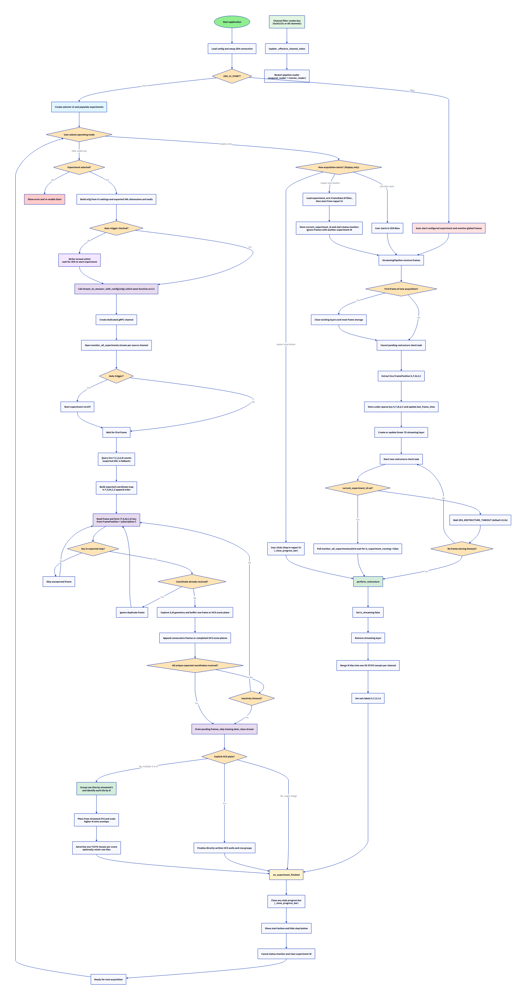

# napari-zenapi-streaming

`napari-zenapi-streaming` is a napari plugin and Python app that streams live
microscopy image data from ZEISS ZEN Blue into napari via the ZEN API (gRPC).

It supports two operating modes selectable from the plugin UI:

| Mode              | What it does                                                                                                                                                                      |
| ----------------- | --------------------------------------------------------------------------------------------------------------------------------------------------------------------------------- |
| **Display only**  | Streams frames into napari for real-time visualization. Uses an async pipeline with sparse storage and post-acquisition restructure into per-channel scene mosaics.               |
| **OME-ZARR only** | Writes frames directly to an OME-ZARR file on-the-fly. Bypasses the pipeline entirely and calls the same standalone function as the CLI script (`stream_to_omezarr_with_config`). |

In both modes experiments can be started from the napari UI or from ZEN Blue.

A **standalone CLI** (`ZEN_stream2omezarr.py`) is also available to stream
directly to OME-ZARR without napari.

## Current status

- Project phase: alpha / MVP
- Primary OS target: Windows for ZEN Blue and the ZEN API Gateway
- Python target: `>=3.11, <3.14`

## Known limitations

- ZEN Blue and the ZEN API Gateway are required for live acquisition. Automated
  tests use simulated responses; they do not establish end-to-end throughput or
  frame completeness on real hardware. ZEN Blue and its gateway run on Windows.
- Running napari on a separate Linux host may be possible, but this remote
  topology is experimental and not officially supported. It requires a fast,
  reliable connection to the Windows gateway and expertise configuring gateway
  certificates and trust for the remote client; it has not been validated here.
- The OME-ZARR writer accepts only 2D `GRAY8` and `GRAY16` frames. Color pixel
  types are not supported by that output path.
- ZEN-started Display mode monitors the global pixel stream without a known
  experiment ID; run only one acquisition at a time in this mode.
- Display mode retains received frames in memory for final scene assembly.
  Very large or long acquisitions may exceed available RAM; the standalone
  unconfigured `--experiment` CLI mode also buffers the acquisition.
- Out-of-order OME-ZARR frames use a bounded pending buffer. If the stream
  stays incomplete until the inactivity timeout, missing positions are
  skipped in the output rather than recovered from ZEN. Inspect acquisition
  logs and frame counts before relying on an incomplete result.

## Features

- Live frame ingestion through `ExperimentStreamingService` (gRPC).
- **Display mode:** Buffered async pipeline (`reader → queue → processor`)
  for smooth UI updates, sparse frame storage, automatic post-acquisition
  restructure from a 7D streaming layer to 5D `S,T,Z,Y,X` scene mosaics
  per channel (merging the `M` tiles spatially).
- **OME-ZARR mode:** Dedicated gRPC channel, tight read loop, on-the-fly
  writes via `ome-writers`. Identical code path for both plugin and CLI.
- Acquisition dimensions and Z spacing are derived automatically from the
  selected experiment XML. Changing the selection refreshes these values.
- OME-ZARR dtype is derived from the runtime frame `PixelType`; the raw
  payload size is checked before decoding.
- Incoming frames are assigned from live stream metadata. In particular,
  `FramePosition.s` and `FramePosition.m` select the scene and tile; frame
  arrival order and XML TileRegion order are not used for assignment.
- Thread-safe napari updates via Qt signals/slots.
- Configurable startup and timeout behavior from `.env` or CLI.

## Repository layout

```text
src/napari_zen_streaming/
  main.py              # App entrypoint and orchestration
  ZEN_config.py        # Runtime config dataclasses + env parsing
  ZEN_init.py          # gRPC connection + experiment lifecycle helpers
  ZEN_pipeline.py      # Async streaming reader/processor pipeline (Display mode)
  ZEN_ui.py            # Viewer UI, layer lifecycle, mode switching
  ZEN_utils.py         # Metadata + image processing functions
  ZEN_omezarr.py       # OME-ZARR helpers, ExperimentConfig, viewer launchers
  ZEN_stream2omezarr.py # Standalone OME-ZARR streaming (CLI + plugin backend)
  _widget.py           # Napari plugin widget entrypoint
  misc.py              # gRPC channel initialization from config.ini
  napari.yaml          # Plugin manifest
  .env                 # Environment variable overrides (local)

experiment_streaming_config.ini  # Experiment config for OME-ZARR streaming

docs/
  *.mermaid, *.d2      # Flow and sequence diagrams
```

## Requirements

- ZEISS ZEN Blue with ZEN API Gateway installed
- A valid ZEN control token
- Access to the ZEN API certificate (`ZenApiPersonalSigningRootCA.pem`)
- Conda or mamba recommended for environment setup

## Installation

1. Create and activate the conda environment:

```bash
conda env create -f python_env/env_zenapi_napari.yml
conda activate zenapi-napari
```

1. Install this package in editable mode:

```bash
pip install -e .
```

The plugin requires the ZEISS `zen_api` wheel, which is not a PyPI dependency.
Install a compatible wheel from an authorized ZEISS distribution before using
the plugin. Do not commit the wheel to this repository without confirming
redistribution rights. The wheel URL in the Conda environment manifest is
currently unavailable (HTTP 404); update it before using that installation
route.

## Configuration

### 1) `config.ini` (required)

Copy `config_example.ini` to `config.ini` in the repository root and update
the ZEN API host, certificate path, and control token. The plugin requires
this file. For the napari plugin, set `ZEN_CONFIG_FILE` in the package-local
`.env` to use a different path; for standalone runs, pass `--config-file`.

```ini
[api]
host = 127.0.0.1
port = 5000
cert_file = C:\ProgramData\Carl Zeiss\ZenApiGateway\Certificates\ZenApiPersonalSigningRootCA.pem
control-token = your-control-token

[image_streaming]
host = 127.0.0.1
port = 5280
```

The loopback addresses above assume napari runs on the same Windows host as
ZEN Blue. A remote client needs reachable control and image-streaming hosts
and a certificate configuration appropriate to the gateway hostname. The
certificate path shown above is a Windows-local example, not a Linux path.

### 2) Environment variables (optional)

You can define these in the `.env` file at `src/napari_zen_streaming/.env`.

| Variable                               | Meaning                                                                                | Default            |
| -------------------------------------- | -------------------------------------------------------------------------------------- | ------------------ |
| `ZEN_EXP_NAME`                         | Experiment name used for auto-start mode                                               | `ZEN_API_overview` |
| `ZEN_UI_START`                         | `true`: show selector UI and start manually; `false`: start `ZEN_EXP_NAME` immediately | `true`             |
| `ZEN_CONFIG_FILE`                      | Path to config file                                                                    | `config.ini`       |
| `ZEN_CHANNEL_INDEX`                    | gRPC channel index filter (integer). Leave empty or unset to receive **all channels**  | unset (all)        |
| `ZEN_RESTRUCTURE_TIMEOUT`              | Idle timeout (seconds) before final restructure in ZEN-started mode                    | `10.0`             |
| `ZEN_SHOW_ONLY_LAST_FRAME_DURING_LIVE` | Use the lightweight 2D latest-frame preview in Display mode                            | `true`             |
| `ZEN_OUTPUT_DIR`                       | Default output directory for OME-ZARR files                                            | unset              |
| `ZEN_LOG_DIR`                          | Directory containing the rotating `zen_streaming.log` file                             | platform default   |
| `ZEN_LOG_LEVEL`                        | Logging verbosity: `DEBUG`, `INFO`, `WARNING`, `ERROR`, or `CRITICAL`                  | `INFO`             |

The package-local `.env` supplies optional runtime settings such as the
experiment name, startup mode, channel filter, display behavior, and the path
to `config.ini`. It does not contain the ZEN API control token or certificate;
those remain in the required `config.ini`.

The standalone app loads `.env` without replacing variables already present in
the process, then applies explicit CLI flags. Its precedence is CLI flags,
process environment, `.env`, then code defaults. The napari plugin explicitly
loads the package-local `.env` with `override=True`, so values set there take
precedence over matching process environment variables. Variables absent from
`.env` still fall back to the process environment and then code defaults.

To place the logfile in a custom directory, set an absolute path in the
package-local `.env`, for example:

```dotenv
ZEN_LOG_DIR=F:\Zen_Output\logs
ZEN_LOG_LEVEL=DEBUG
```

Leave `ZEN_LOG_DIR=` empty or remove the line to use the platform-specific
default documented in [Logging](#logging). Restart napari after changing the
file because logging is configured when the plugin widget opens.

## Running

### Option A: Run as a napari plugin

1. Start napari:

```bash
napari
```

1. Open plugin widgets:

- `Plugins > ZEN API Streaming > ZEN API Streaming`

### Option B: Run as a module

```bash
python -m napari_zen_streaming.main
```

With CLI overrides:

```bash
python -m napari_zen_streaming.main --ui-start true --exp-name ZEN_API_overview --config-file config.ini --channel-index 0 --restructure-timeout 10
```

## Runtime behavior

### Operating modes

The plugin UI exposes a **Mode** dropdown with two options:

#### Display only (index 0)

Uses the full async streaming pipeline (`ZEN_pipeline.py`):

1. **Streaming phase** – Frames are received via `monitor_all_experiments()`,
   processed in `ZEN_utils.process_frame()`, and stored in a sparse dict.
  The sparse key `(S, T, M, Z, C)` comes directly from each frame's
  `FramePosition` metadata, including its S and M indices. By default,
  **Show only last frame during live** displays a fixed 2D YX layer and
  replaces it with the newest frame without rebuilding acquisition history.
  Every frame remains in sparse storage for final assembly. Uncheck the
  option to restore the more expensive 7D frame-history preview. The option
  is frozen during acquisition and re-enabled after scene assembly.
2. **Channel filter** – A **Channel filter** combo box lets you select a
   specific gRPC channel index (0–31) or receive all channels.  Changing the
   filter immediately restarts the pipeline reader so the new filter is active
   without a Start click.  The initial value comes from `ZEN_CHANNEL_INDEX`
   in `.env`; leave it empty to receive all channels.
3. **Completion detection** –
   - Napari-started experiments: the status monitor watches
     `is_experiment_running`. Because ZEN can report completion before all
     gRPC pixel data arrives, the plugin then waits for the XML-derived unique
     frame count and uses pixel-stream inactivity as a safety fallback.
   - ZEN-started experiments: inactivity timeout (`ZEN_RESTRUCTURE_TIMEOUT`).

**Experiment identity:** Display mode keeps one
`monitor_all_experiments()` subscription open because the targeted ZEN stream
can close when experiment status changes to finished, before trailing pixel
payloads have arrived. For a Napari-started acquisition, the plugin loads the
experiment first, arms a client-side filter for its `FrameData.experiment_id`,
and only then starts acquisition. Frames from other experiments are ignored
while that filter is active, including during trailing-frame drain. The filter
is cleared after final restructure so later ZEN-started acquisitions remain
discoverable. A ZEN-started run has no experiment ID known in advance and
therefore continues to accept the global stream; keep only one such
acquisition active at a time.

1. **Post-processing** – The streaming layer is removed and each scene's M
  tiles are placed from their streamed stage coordinates into per-channel
  5D layers (`S, T, Z, Y, X`). In overlap regions, pixels from the tile with
  the higher M index replace pixels from lower-M tiles.

#### OME-ZARR only (index 1)

Bypasses the pipeline entirely.  When **Start** is clicked:

1. A fresh `ExperimentConfig` is built from the selected experiment, the
  OME-ZARR controls, the main ZEN API gateway config, and fixed plugin
  defaults. XML-derived T/C/Z/M/S and Z spacing replace its planning
  placeholders before writing. No experiment INI is selected by the plugin.
2. **Auto-trigger checkbox** — "Start experiment via ZEN API":
   - **Checked (default):** clicking Start immediately triggers the experiment
     via the ZEN API and calls `stream_to_omezarr_with_config(ecfg)`.
   - **Unchecked:** clicking Start arms the writer
     (button shows **"Writer Armed — start ZEN Experiment"**)
     and waits for the user to start the experiment manually in ZEN Blue.
     The writer activates as soon as the first frame arrives.
3. `stream_to_omezarr_with_config(ecfg)` — the **same function** used by the
   standalone CLI — creates its own dedicated gRPC channel, opens the pixel
  stream, optionally starts the experiment, and queries live status when
  the first frame arrives. Positive live T/C/Z/S/M counts define the valid
  coordinate ranges; XML-derived values remain the fallback if status is
  unavailable.
4. Each frame is routed by `(T, S, M, C, Z)`. T/S/M/Z come from that frame's
  `FramePosition`; C comes from the explicit channel subscription because
  all-channel mode merges one gRPC stream per source channel. The tuple is
  mapped to the linear append order required by `ome-writers`. Frames may
  arrive in any order and wait in a `pending` buffer. Duplicate tuples and
  tuples outside the expected live/configured ranges are skipped; only
  consecutive linear slots are appended to the Zarr stream.
  The first frame's runtime `PixelType` selects `uint8` for `GRAY8` or
  `uint16` for `GRAY16`; payload length is validated before decoding. ZEN
  width is stored on X and height on Y without a rotation or transpose.
  Streamed X/Y stage positions and pixel scales retain the same axis names.
5. The loop ends after every unique expected coordinate has arrived, or on
  inactivity timeout. On timeout, buffered frames are drained and truly
  missing slots are emitted with `stream.skip()` so the array stays
  rectangular.
6. For generic acquisitions with multiple scenes or tiles, the raw tile
  streams are finalized into one TCZYX mosaic per scene. Streamed XYZ
  coordinates and physical pixel scaling determine placement; M identifies
  the raw tile within S but does not imply a row or column. In overlaps, the
  highest M index wins, and gaps in irregular scene outlines remain at the
  array fill value. The `OME/series` list advertises only the scene mosaics.
  **Keep individual source tiles** controls whether the raw tile groups remain
  after successful mosaic assembly. It is unchecked by default to avoid
  duplicated pixel storage. For HCS acquisitions, one frame from every M tile
  first establishes each scene canvas. The writer then buffers only the tiles
  for each `(T, S, C, Z)` plane, merges them in memory, and writes the final
  well image directly. Raw HCS tile arrays are never created, so the store is
  not reread or rewritten after acquisition. The source-tile control is hidden
  for HCS output because it does not apply.
7. **Button state sequence:**
   `Start Selected Experiment` → *(click)* →
   `Writer Armed — start ZEN Experiment` *(auto-trigger off)* or
   `Experiment Running...` *(auto-trigger on)* →
   `Experiment & Stream Running` *(first frame arrived)* →
   back to `Start Selected Experiment` *(done)*.
8. Worker-to-Qt progress notifications are limited to approximately 10 Hz.
  This keeps napari responsive without throttling frame reception or
  OME-ZARR writes; first-frame, final-frame, and completion updates are
  always delivered.

The plugin and the configured CLI share the same writer. Both use a dedicated
gRPC channel, avoiding frame loss from a competing pipeline reader; the
unconfigured `--experiment` CLI mode instead buffers the full acquisition.

### Plugin OME-ZARR defaults

The plugin exposes output directory, compression, auto-trigger, HCS layout,
and **Create pyramid after acquisition** in its UI. When enabled, choose how
many 2x Y/X downsampled levels to append after acquisition completes. Napari
opens the OME-Zarr only after pyramid generation finishes. Existing level `0`
is reused and is never rewritten.
Generic scene mosaics also expose **Keep individual source tiles**; unchecked
removes source groups only after mosaic creation succeeds. Advanced values
intentionally use fixed defaults declared at the top of `ZEN_omezarr.py`:

- `PLUGIN_DEFAULT_CZI_NAME = "zenapi_stream"`
- `PLUGIN_DEFAULT_OVERWRITE_CZI = True`
- `PLUGIN_DEFAULT_OVERWRITE_ZARR = True`
- `PLUGIN_DEFAULT_SPATIAL_SHARD_SIZE_CHUNKS = 2`
- `PLUGIN_DEFAULT_PYRAMID_LEVELS = 0`

Change those constants to alter plugin behavior globally. Plugin OME-ZARR
dtype is not a fixed default: it is derived from the first runtime frame's
ZEN `PixelType`. Color pixel types are rejected because the current writer
models each streamed frame as a two-dimensional grayscale plane.

### Standalone experiment config INI

The standalone CLI config mode accepts `experiment_streaming_config.ini`. The
plugin does not load this file. Before opening pixel subscriptions, the CLI
loads and exports the named experiment through ZEN API. Exported T/C/Z/M/S,
Z spacing, and scene-to-well positions replace the INI's dimension defaults;
this ensures all active channels are subscribed and explicit wells can use
the HCS plate layout. The INI supplies the other run settings:

- `[experiment]` – name, CZI output name, start mode, overwrite settings.
- `[dimensions]` – legacy dimension fallbacks for callers of
  `load_experiment_config()`. The configured CLI replaces them with exported
  experiment metadata before opening the writer.
- `[output]` – directory, dtype fallback, compression, overwrite,
  `keep_source_tiles`, and optional `spatial_shard_size_chunks` for Zarr v3
  Y/X sharding. Set the shard size to `0` or leave it empty to disable
  sharding. `pyramid_levels` controls post-acquisition Y/X pyramid creation.
- `[stream]` – optional source channel filter and `max_pending_frames` safety
  bound for out-of-order frames.

Before OME-ZARR streaming, both the plugin and the configured CLI load and
export the selected ZEN experiment to derive T, C, Z, M, and S from its XML.
Active rectangular
`TileRegion` grids describe scene-specific tile layouts; for example, two
active 3-by-2 grids produce S=2 and M=6. The total frame count is recalculated
from the exported metadata. These values plan the acquisition and provide a
fallback, but they do not assign incoming pixels. The first live status
snapshot replaces positive T/C/Z/S/M counts before the writer layout is
opened. Every frame is then assigned by its live `FramePosition`, including
`FramePosition.s` and `FramePosition.m`; per-frame XYZ and scaling remain
authoritative for physical tile placement.

### Stream metadata authority

The writer deliberately separates acquisition planning from frame routing:

| Metadata source                       | Role                                                                                       |
| ------------------------------------- | ------------------------------------------------------------------------------------------ |
| Selected experiment XML               | Planned T/C/Z/S/M and Z spacing; fallback when live status is unavailable.                 |
| First live `get_status()` response    | Positive T/C/Z/S/M counts used to build the valid coordinate space and expected frame set. |
| Per-frame `FramePosition`             | T/S/M/Z assignment for that incoming image. C is the merged subscription index.            |
| First frame `pixel_data.pixel_type`   | OME-ZARR NumPy dtype, validated against the raw payload byte count.                        |
| Per-frame stage XYZ and pixel scaling | Native X/Y physical placement and scale of each M tile inside its S scene.                 |

Consequently, ZEN may deliver channel-major or otherwise out-of-order frames
without changing their destination. Scene membership is always the streamed S
index, tile identity is always the streamed M index, and spatial placement is
always based on streamed physical coordinates rather than an assumed grid.

### Standalone CLI

`ZEN_stream2omezarr.py` can be run directly without napari:

```bash
# Config mode (export metadata first, then write on-the-fly):
python -m napari_zen_streaming.ZEN_stream2omezarr \
    --experiment-config experiment_streaming_config.ini

# CLI mode (unknown dimensions, buffered write):
python -m napari_zen_streaming.ZEN_stream2omezarr \
    --experiment MyExp --output-dir ./output --start-experiment

# Wait for user to start from ZEN UI:
python -m napari_zen_streaming.ZEN_stream2omezarr \
    --experiment-config experiment_streaming_config.ini --no-start-experiment

# Open viewer after acquisition:
python -m napari_zen_streaming.ZEN_stream2omezarr \
    --experiment-config experiment_streaming_config.ini --viewer ndv

# Override the INI and append three pyramid levels after acquisition:
python -m napari_zen_streaming.ZEN_stream2omezarr \
  --experiment-config experiment_streaming_config.ini --pyramid-levels 3
```

## Logging

- Log file on Windows:
  `C:\Users\<username>\AppData\Local\napari-zenapi-streaming\logs\zen_streaming.log`
  (`%LOCALAPPDATA%\napari-zenapi-streaming\logs\zen_streaming.log`).
  `AppData` is hidden by default in File Explorer.
- Log file on Linux/macOS: `$XDG_STATE_HOME/napari-zenapi-streaming/logs/zen_streaming.log`
  (or `~/.local/state/napari-zenapi-streaming/logs/zen_streaming.log`)
- Set `ZEN_LOG_DIR` to override the log directory.
- Logs rotate at 5 MB and retain three backups.
- Messages are also written to the terminal that launched napari after the
  plugin widget is opened.
- Set `ZEN_LOG_LEVEL=DEBUG` in `.env` to include connection, pipeline, frame
  processing, layer-update, and restructure details. The default `INFO` level
  records only milestones, warnings, and errors.
- Logging format: `%(asctime)s - %(name)s - %(levelname)s - %(message)s`

To see live terminal records, launch napari from the Pixi workspace and keep
that terminal open:

```powershell
cd F:\Pixi_Projects\zen_czi\zen-pixi-workspace
pixi run start-napari
```

Logging starts when the **ZEN API Streaming** plugin widget is opened. A napari
process launched from the Start menu or another detached GUI launcher cannot
write records into an existing PowerShell terminal.

On Windows, print the exact logfile location for the current user:

```powershell
$logFile = "$env:LOCALAPPDATA\napari-zenapi-streaming\logs\zen_streaming.log"
$logFile
```

Open its directory in File Explorer:

```powershell
explorer.exe "$env:LOCALAPPDATA\napari-zenapi-streaming\logs"
```

If `ZEN_LOG_DIR` is not set, follow the default Windows logfile in a separate
PowerShell terminal:

```powershell
Get-Content "$env:LOCALAPPDATA\napari-zenapi-streaming\logs\zen_streaming.log" -Wait
```

When `ZEN_LOG_DIR=F:\Zen_Output\logs`, use the configured location instead:

```powershell
Get-Content "F:\Zen_Output\logs\zen_streaming.log" -Wait
```

`Get-Content` prints the existing records and `-Wait` keeps the command
running so new records appear as they are written. Press `Ctrl+C` to stop.
If the 5 MB logfile rotates while this command is running, restart the command
to follow the new active `zen_streaming.log` file.

## Architecture

The proposed optimization for preventing live-preview rendering from falling
behind pixel delivery is documented in the
[Live Preview Performance Plan](docs/live_preview_performance_plan.md).

### Display mode data flow

```text
ZEN Blue  ──gRPC──▶  StreamingPipeline  ──queue──▶  Processor
                       (reader task)                   │
                                                       ▼
                                               add_frame() ──Qt signal──▶ napari viewer
                                                       │
                                                  sparse dict
                                                       │
                                              ┌────────▼────────────┐
                                              │ perform_restructure │
                                              │  7D → 5D STZYX     │
                                              │ per-channel mosaic │
                                              └─────────────────────┘
```

### OME-ZARR mode data flow

```text
ZEN Blue  ──gRPC──▶  stream_to_omezarr_with_config()
                       (dedicated gRPC channel)
                       │
                       ├─ open one pixel stream per selected source channel
                       ├─ optionally start experiment (auto-trigger)
                       ├─ first frame: live T/C/Z/S/M status
                       ├─ each frame: key = (T,S,M,C,Z)
                       │    ├─ reject unexpected or duplicate key
                       │    ├─ generic: buffer by raw linear slot
                       │    └─ HCS: buffer M tiles for one T/S/C/Z plane
                       │         ├─ merge tiles from XYZ and pixel scale
                       │         └─ append one final scene plane
                       ├─ complete unique key set or inactivity timeout
                       ├─ drain pending frames and skip missing slots
                       └─ generic only: finalize S/M tiles
                           ├─ group by FramePosition.s
                           ├─ identify tile by FramePosition.m
                           ├─ place from streamed XYZ and pixel scale
                           ├─ higher M wins overlaps
                           └─ advertise one TCZYX image per scene
```

Both flows use the same `monitor_all_experiments()` gRPC call.
The OME-ZARR path creates its own channel so there is no contention.

## Diagrams and docs

- Sequence diagram: `docs/napari_zenapi_streaming_sequence.mermaid`
- Flowchart: `docs/napari_zenapi_streaming_flowchart.mermaid`
- D2 variants: `docs/napari_zenapi_streaming_sequence.d2`,
  `docs/napari_zenapi_streaming_flowchart.d2`

Flowchart preview:



Editable source files:

- Mermaid flowchart source: `docs/napari_zenapi_streaming_flowchart.mermaid`
- Mermaid sequence source: `docs/napari_zenapi_streaming_sequence.mermaid`

## Troubleshooting

- `FileNotFoundError` for `config.ini`: check `ZEN_CONFIG_FILE` path and working directory.
- TLS or certificate issues: verify `cert_file` path and that the file is readable.
- No experiments in dropdown: confirm ZEN API Gateway is running and token is valid.
- Viewer not updating: check `zen_streaming.log` in the user log directory described above for pipeline errors.
- Restructure too early/late for ZEN-started runs: adjust `ZEN_RESTRUCTURE_TIMEOUT`.
- **Progress bar stuck on "Streaming frames":** if ZEN stops an experiment
  without the plugin detecting it (e.g. network glitch), click **Stop** to
  dismiss the bar.  Clicking **Start** on the next experiment also clears any
  stale bar automatically.
- **Frames received in Display mode while OME-ZARR mode is active:** harmless —
  the pipeline discards frames when the standalone writer is the active path.
- **Channel filter not taking effect:** ensure no experiment is currently
  running; the reader restarts on combo box change, but an in-flight gRPC
  stream may buffer a few straggler frames.

## Development

- Install development extras:

```bash
pip install -e .[dev]
```

- Format settings are defined in `pyproject.toml` (Black, line length 79).
- Current automated tests are minimal (`src/napari_zen_streaming/_tests`).
- CI requires a repository secret named `ZEN_API_WHEEL_URL` pointing to an
  authorized, reachable `zen_api` wheel. Test jobs fail explicitly without it;
  forked pull requests cannot use repository secrets by default.

## Authors

- Krijn H. van der Steen (UMC Utrecht)
- Sebastian Rhode (ZEISS)

## License

BSD 3-Clause (see `LICENSE`).
